# 预训练语言模型微调与部署

> 导读: 该部分介绍预训练模型微调
想提升预训练模型在指定任务上的性能？让我们选择合适的预训练模型，在特定任务上进行微调，并将微调后的模型部署成方便使用的Demo！
## 本教程目标：
1. 熟悉使用Transformers工具包
2. 掌握预训练模型的微调、推理（解耦可定制版本 & 默认集成版本）
3. 掌握利用Gradio Spaces进行Demo部署
4. 了解不同类型的预训练模型的选型和应用场景
## 本教程内容：
### 1. 工作准备：
#### 1.1 了解工具包：Transformers
https://github.com/huggingface/transformers

> 🤗 Transformers 提供了可以轻松地下载并且训练先进的预训练模型的 API 和工具。使用预训练模型可以减少计算消耗和碳排放，并且节省从头训练所需要的时间和资源。这些模型支持不同模态中的常见任务，比如：
📝 自然语言处理：文本分类、命名实体识别、问答、语言建模、摘要、翻译、多项选择和文本生成。
🖼️ 机器视觉：图像分类、目标检测和语义分割。
🗣️ 音频：自动语音识别和音频分类。
🐙 多模态：表格问答、光学字符识别、从扫描文档提取信息、视频分类和视觉问答。

详细中文文档：https://huggingface.co/docs/transformers/main/zh/index

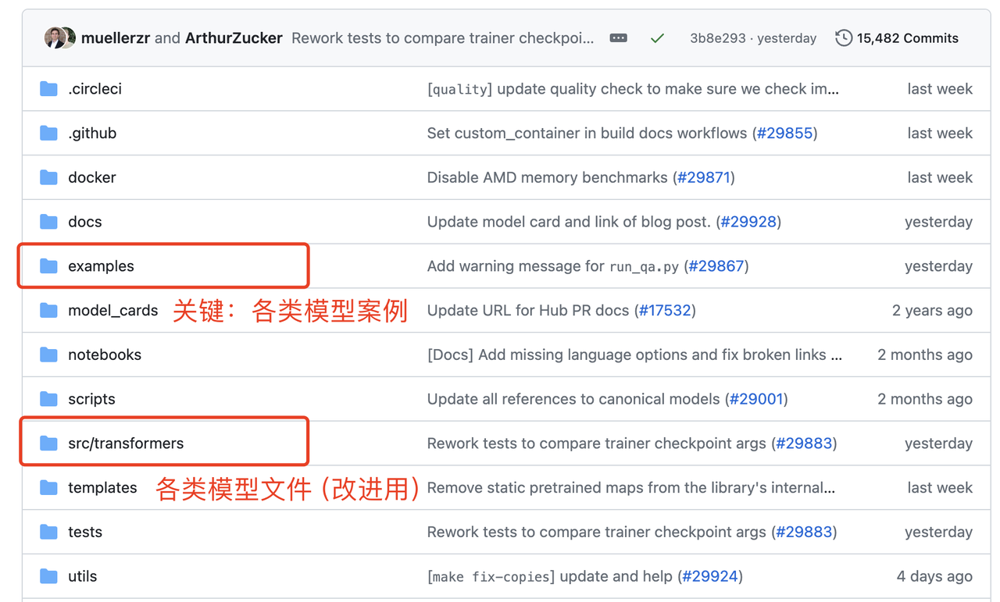

#### 1.2 安装环境：以文本分类（e.g., 虚假新闻检测）为例
1. 我们进入到文本分类的案例库，参考readme了解关键参数，下载requirements.txt和run_classification.py

https://github.com/huggingface/transformers/tree/main/examples/pytorch/text-classification

2. 安装环境：
- 1. 通过conda创建新的环境：conda create -n llm python=3.9
- 2. 进入虚拟环境：conda activate llm
- 3. pip install transformers
- 4. 删除requirements.txt中自动安装的torch，pip install -r requirements.txt

> 若下载速度慢，可使用国内源：pip [Packages] -i https://pypi.tuna.tsinghua.edu.cn/simple

> 若使用国内源安装pytorch，将自动选择pytorch的cpu版本，无法运行gpu，因此——

- 5. conda install pytorch

> 若下载速度慢，可按照该博客配置conda镜像：https://blog.csdn.net/weixin_42797483/article/details/132048218

3. 准备数据：我们以Kaggle上的虚假推文数据集为例：https://www.kaggle.com/c/nlp-getting-started/data

#### 1.3 处理好的工程包（演示代码和数据）
（1）解耦可定制版本（关键模块解耦，方便理解，可自定义数据加载、模型结构、评价指标等）

[TextClassificationCustom下载链接](https://pan.quark.cn/s/00dae5c2b128)

（2）默认集成版本（代码较
为丰富、复杂，一般直接超参数调用，略有开发门槛）

[TextClassification下载链接](https://pan.quark.cn/s/9d0510f1c98d)


### 2. 基于解耦版本进行定制开发（最小可行性产品MVP）
共三个主要文件：main.py主程序，utils_data.py数据加载和处理文件，modeling_bert.py模型结构文件

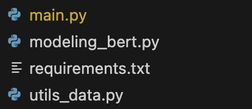

#### 2.1 理解关键模块
1. 加载和处理数据（utils_data.py）
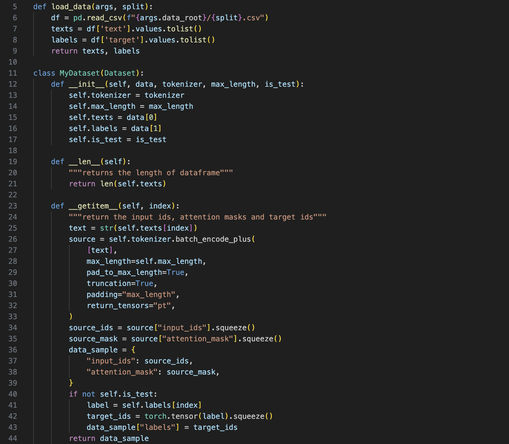

2. 加载模型（modeling_bert.py）


3. 训练/验证/预测（main.py）

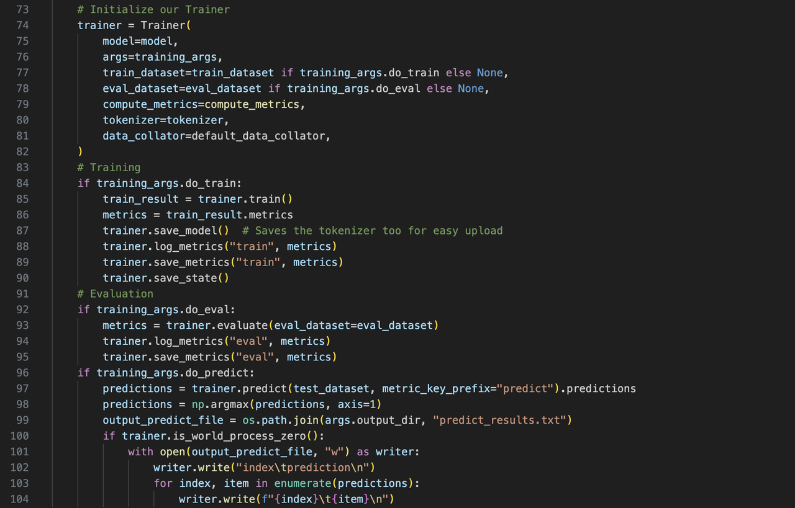

#### 2.2 运行训练/验证/预测一条龙
```shell
python main.py
```

### 3. 基于集成版本进行微调（Optional，基于run_classification.py）

#### 3.1 理解关键模块：
1. 加载数据（csv或json格式）
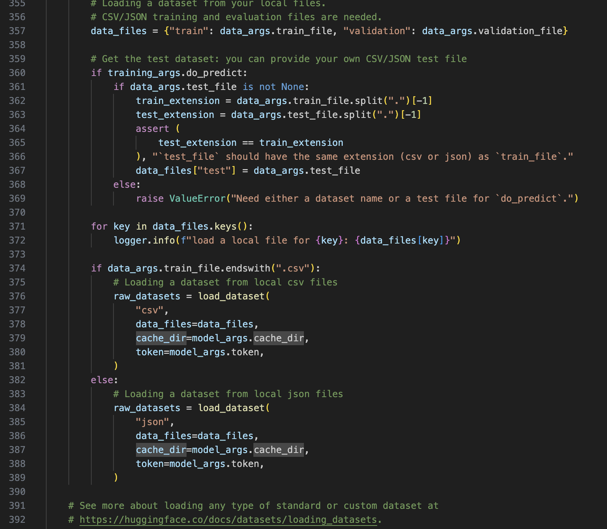

2. 处理数据
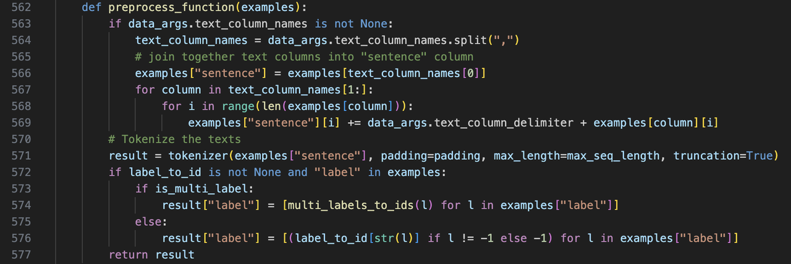

3. 加载模型
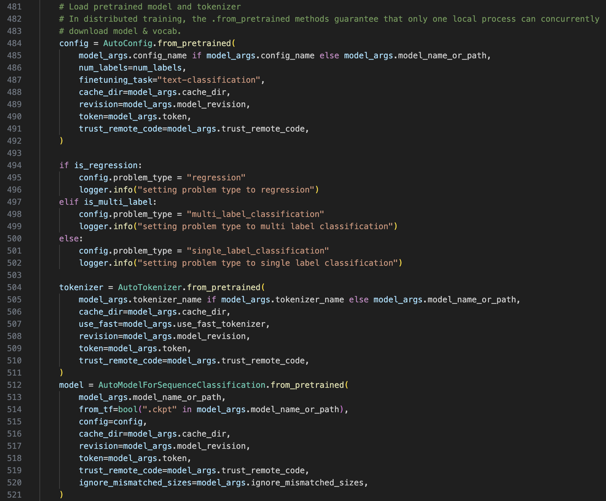

4. 训练/验证/预测
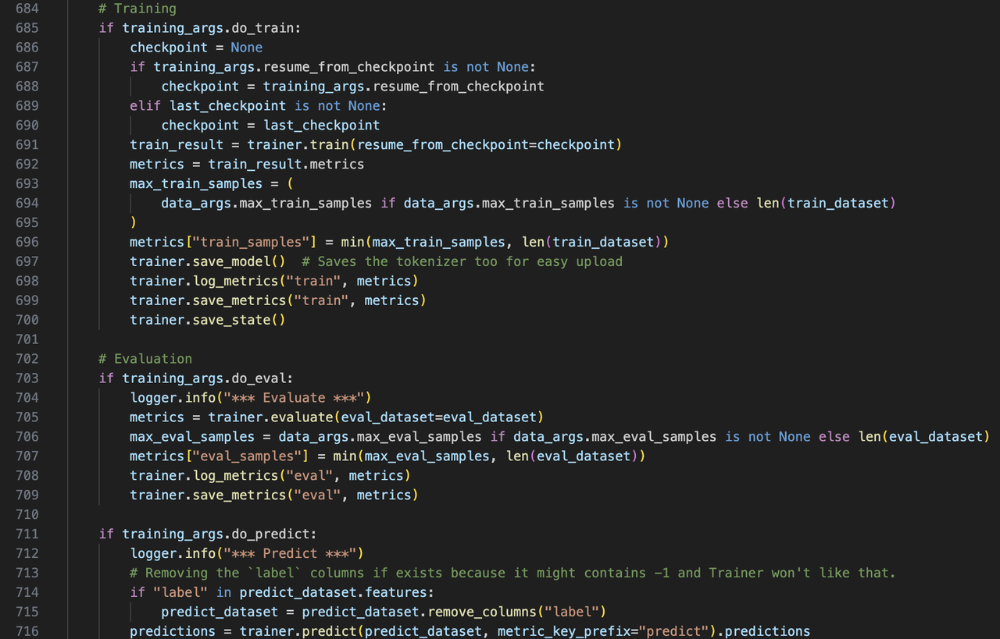

#### 3.2 训练模型
同时在开发集上验证，在测试集上预测，执行下述脚本：

```shell
python run_classification.py \
    --model_name_or_path  bert-base-uncased \
    --train_file data/train.csv \
    --validation_file data/val.csv \
    --test_file data/test.csv \
    --shuffle_train_dataset \
    --metric_name accuracy \
    --text_column_name "text" \
    --text_column_delimiter "\n" \
    --label_column_name "target" \
    --do_train \
    --do_eval \
    --do_predict \
    --max_seq_length 512 \
    --per_device_train_batch_size 32 \
    --learning_rate 2e-5 \
    --num_train_epochs 1 \
    --output_dir experiments/
```

若出现报错或卡住，通常是网络问题：

1. <u>下载模型时显示“Network is unreachable”，手动下载模型到本地：https://huggingface.co/google-bert/bert-base-uncased</u>
2. <u>若加完数据后卡住不动，CTRL+C终止后显示卡在“connection”，则是evaluate包加载评价指标时网络连接失败所致。</u>

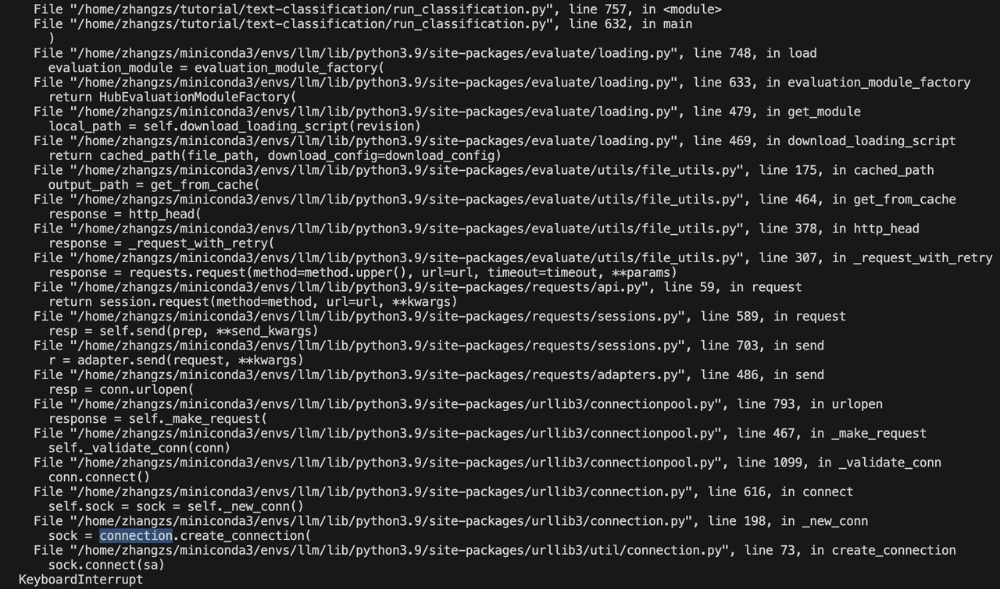

此时，可去evaluate的GitHub下载整个包：https://github.com/huggingface/evaluate/tree/main，并在超参数中将--metric_name路径改成本地的指标路径，即：

```shell
python run_classification.py \
    --model_name_or_path  bert-base-uncased \
    --train_file data/train.csv \
    --validation_file data/val.csv \
    --test_file data/test.csv \
    --shuffle_train_dataset \
    --metric_name evaluate/metrics/accuracy/accuracy.py \
    --text_column_name "text" \
    --text_column_delimiter "\n" \
    --label_column_name "target" \
    --do_train \
    --do_eval \
    --do_predict \
    --max_seq_length 512 \
    --per_device_train_batch_size 32 \
    --learning_rate 2e-5 \
    --num_train_epochs 1 \
    --output_dir experiments/
```

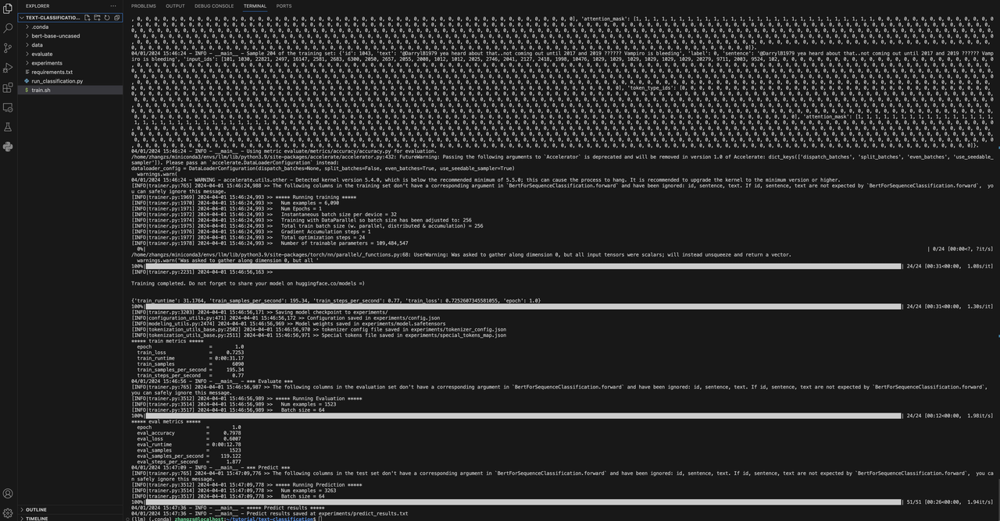


### 4. 部署模型：模型训练完毕后，我们可以在Gradio Spaces上搭建在线demos
#### 4.1 Gradio Spaces教程
https://huggingface.co/docs/hub/en/spaces-sdks-gradio
#### 4.2 创建spaces
1. https://huggingface.co/new-space?sdk=gradio
2. Note：打不开的话请尝试科学上网

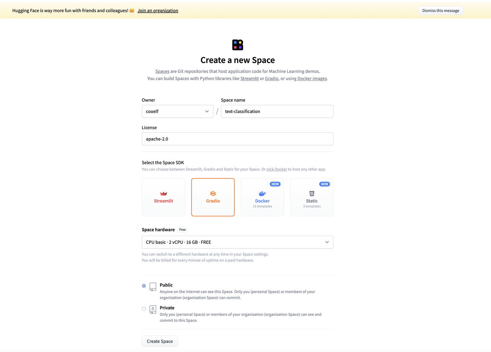

#### 4.3 关键推理代码
具体见工程包中的app.py

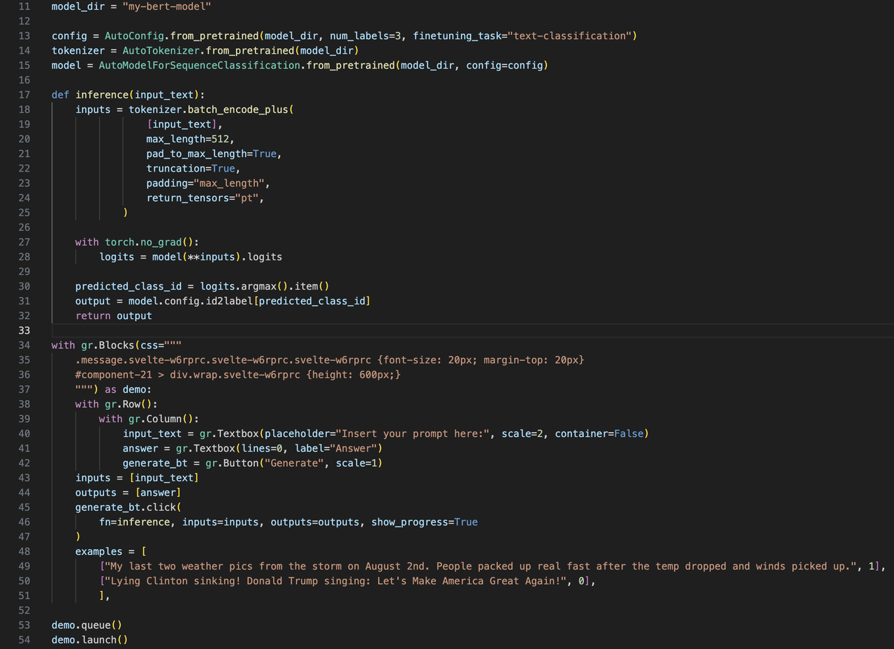

#### 4.4 将app.py、环境配置文件和模型上传到Gradio Spaces
1. 配置文件（requirements.txt）
```
transformers==4.30.2
torch==2.0.0
```

2. 文件概览

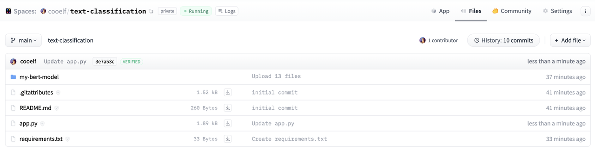


3. Demo效果
成功部署的案例供参考：https://huggingface.co/spaces/cooelf/text-classification
其中在右上角“Files”栏目可以看到源码。

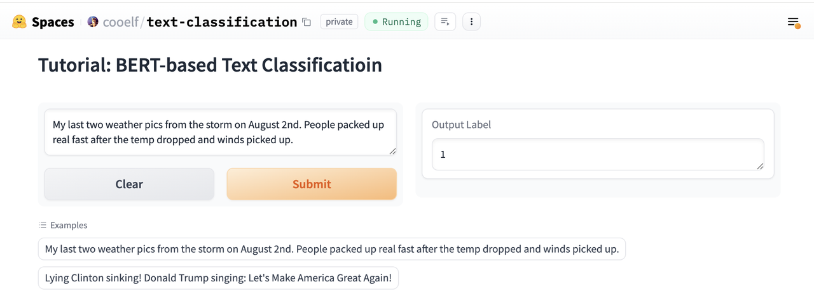


4. 彩蛋：在Spaces平台可以看到每周的热点Demo，且可以搜索感兴趣的大模型、Demo进行尝试
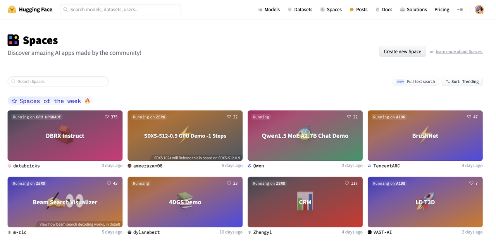


### 5. 进阶练习
1. 试试其他分类/回归任务，例如情感分类、新闻分类、漏洞分类等
2. 试试其他类型的模型，例如T5、ELECTRA等
### 6. 其他常用的模型
1. 问答模型：https://github.com/huggingface/transformers/tree/main/examples/pytorch/question-answering
2. 文本摘要：https://github.com/huggingface/transformers/tree/main/examples/pytorch/summarization
3. 调用Llama2进行推理：https://huggingface.co/docs/transformers/en/model_doc/llama2
4. 对Llama2进行轻量化微调（LoRA）：  https://github.com/peremartra/Large-Language-Model-Notebooks-Course/blob/main/5-Fine%20Tuning/LoRA_Tuning_PEFT.ipynb


### 7. 延伸阅读
1. 一篇对大语言模型（LLMs）进行全面、深入分析的43页[综述](https://mp.weixin.qq.com/s?__biz=Mzk0MTYzMzMxMA==&mid=2247484539&idx=1&sn=6ee42baab4ad792e74ac6a89d7dd87d9&chksm=c2ce3e0af5b9b71c578cb6836e09cce5f60b4a1cfffadc1c4c98211fc0af621bfaaaa8fe0aff&mpshare=1&scene=24&srcid=0331FO6iqVqs5Vx3iHrtqouQ&sharer_shareinfo=45c3fb78d9cfb9627908da44dd7f5559&sharer_shareinfo_first=45c3fb78d9cfb9627908da44dd7f5559&key=a2847c972f830c4143e00e0430f657d8ab5acae4ad24ca628213273021453a3a9e17984627e2ab8506d1dcf6e1fabd9ec3123a5f71d2a65295ad6f6f56da2224d4a6e3228237c237447bbf48a6eff1f53e1971503f26c3fb5b9d99d27eca7266529a5f86d75bada7ec10bf314687bfcbf9fa3b09b8e36e73f6d6a154a5ce5ff0&ascene=14&uin=NzE3NzkyOTQx&devicetype=iMac20%2C1+OSX+OSX+14.2.1+build(23C71)&version=13080610&nettype=WIFI&lang=zh_CN&countrycode=CN&fontScale=100&exportkey=n_ChQIAhIQM7tgcovlhXp1y5J%2BRMnhfhL3AQIE97dBBAEAAAAAAFsTBwTm4FMAAAAOpnltbLcz9gKNyK89dVj0MxFZswDc%2Fk646vJPW2S3JFh8H2JhyZXiPbIl%2Bh23CsewrmIoZ4j0D2zMNylC3pLbhu9FIARUKYn%2F0r0OIdHnxesVFpw1qLo6uBJ3zmbsKBVXM05%2B0MiOBIfShfpiIfraK7THzak94U0RdS1flC%2BIDjTb5SmZs9Z4XTyTsN0QXR6NWjAXFeuxnMB4SENMJ8dUR8n08b3DGKtz9rfefn0JRlsX4mGcLvOFsFwg4nk35nl4C3Wgcs4OYociKm5UHabdhWT7%2FWbNNToZLD39eD%2FL4Xo%3D&acctmode=0&pass_ticket=8xG4QKOnJeEFUtXkScVmMqb3omdWJbPuc%2BhN5%2BA7%2FOXj7ex757M2ABNO4GVVnv2T3VtqrC9gZH%2FrU09rrUxJcA%3D%3D&wx_header=0)（Word2Vec作者出品）
   
    论文题目：Large Language Models: A Survey

    论文链接：https://arxiv.org/pdf/2402.06196.pdf

2. [GPT，GPT-2，GPT-3 论文精读【论文精读】](https://www.bilibili.com/video/BV1AF411b7xQ?t=0.0)

3. [InstructGPT 论文精读【论文精读·48】](https://www.bilibili.com/video/BV1hd4y187CR?t=0.4)
