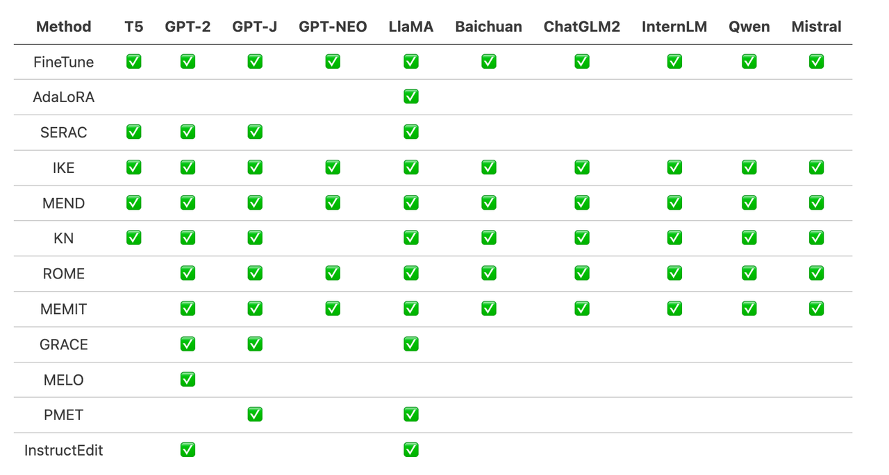
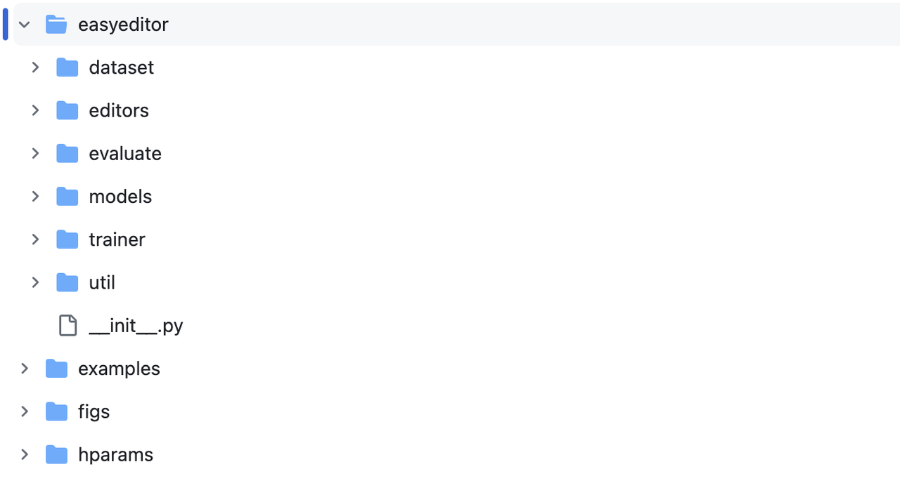
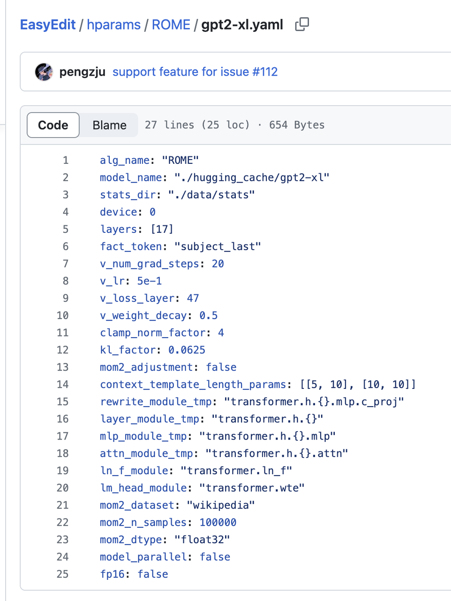
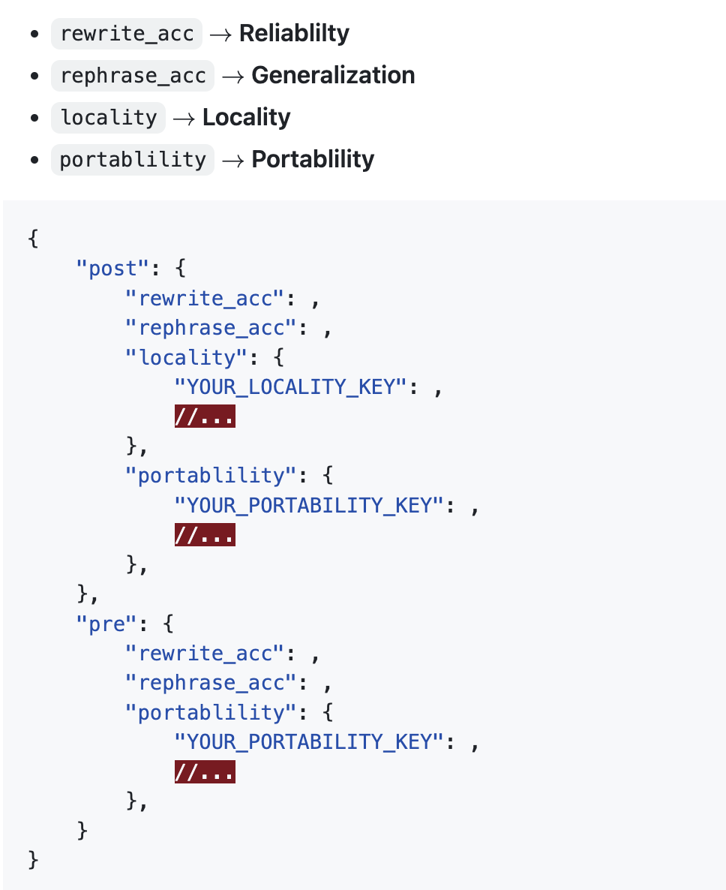

# 动手学大模型：大模型知识编辑
导读: 语言模型的编辑方法和工具
> 想操控语言模型在对指定知识的记忆？让我们选择合适的编辑方法，对特定知识进行编辑，并将对编辑后的模型进行验证！

## 1. 本教程目标：

- 熟悉使用EasyEdit工具包
- 掌握语言模型的编辑方法（最简）
- 了解不同类型的编辑方法的选型和应用场景

## 2. 工作准备：
### 2.1 了解EasyEdit

https://github.com/zjunlp/EasyEdit

EasyEdit 是一个用于编辑语言模型的 Python 包，如 GPT-J、Llama、GPT-NEO、GPT2、T5等，其目标是针对一个特定的知识有效地改变语言模型的行为，而不会对其他输入的性能产生负面影响，同时易于使用且易于扩展。

EasyEdit 集成了现有的流行的编辑方法：


### 2.2 主要框架


EasyEdit包含一个统一的Editor、Method和Evaluate框架，分别代表编辑场景、编辑技术和评估方法。
- Editor：描述工作场景，包含待编辑的模型，待编辑的知识，以及其他必要的超参数。
- Method：所使用的具体知识编辑方法（例如ROME、MEND等）。
- Evaluate：评估知识编辑性能的指标，包含了可靠性、通用性、局部性、可移植性。
- Trainer：有些编辑方法需要一定的训练过程，由Trainer模块实现。
## 3. 安装环境：
```
git clone https://github.com/zjunlp/EasyEdit.git
（可选）conda create -n EasyEdit python=3.9.7
cd EasyEdit
pip install -r requirements.txt
```
## 4. 编辑案例
> 目标：改变GPT-2-XL的知识记忆，将梅西(Lionel Messi)的职业从足球改成篮球(football->basketball). 
步骤：
- 选择编辑方法，准备参数
- 准备知识编辑的数据
- 实例化Editor
- Run！
下面以ROME方法为例具体介绍：
### 4.1 ROME
Jupiter Notebook: [https://colab.research.google.com/drive/1KkyWqyV3BjXCWfdrrgbR-QS3AAokVZbr?usp=sharing#scrollTo=zWfGkNb9FBJQ] 
- 选择编辑方法，准备参数
  - 编辑方法选择为ROME，准备ROME和GPT2-XL所需要的参数。
  - 例如：alg_name: "ROME"，model_name: "./hugging_cache/gpt2-xl"或为本地该模型的路径，"device": 使用的GPU序号
  - 其余参数可保持默认

- 准备知识编辑的数据
    ```
    prompts = ['Question:What sport does Lionel Messi play? Answer:'] # x_e
    ground_truth = ['football'] # y
    target_new = ['basketball'] # y_e
    subject = ['Lionel Messi'] 
    ```
- 实例化Editor，将准备好的参数传入BaseEditor类进行实例化，得到定制的Editor实例。
    ```
    hparams = ROMEHyperParams.from_hparams('./hparams/ROME/gpt2-xl.yaml')
    editor=BaseEditor.from_hparams(hparams)
    ```
- Run! 调用editor的edit方法：
    ```
    metrics, edited_model, _ = editor.edit(
        prompts=prompts,
        ground_truth=ground_truth,
        target_new=target_new,
        subject=subject,
        keep_original_weight=False
    )
    ```

> 备注：首次编辑某个模型时会下载Wiki语料，并为该模型计算各层的状态（stats_dir: "./data/stats"）并存下，在后续的每次编辑中复用。因此，首次编辑有所耗时，确保网络通畅的情况下可耐心等待。
### 4.2 验证与评估
editor.edit会返回metrics（由EasyEdit的Evaluate模块计算）。形式为：

要得到通用性、局部性、可移植性的数值，需要在edit方法中传入用于评估的数据。

以局部性为例，会导致edit方法计算局部性的指标，即在locality_inputs上模型回答的正确率。
```
locality_inputs = {
    'neighborhood':{
        'prompt': ['Joseph Fischhof, the', 'Larry Bird is a professional', 'In Forssa, they understand'],
        'ground_truth': ['piano', 'basketball', 'Finnish']
    }
}
metrics, edited_model, _ = editor.edit(
    prompts=prompts,
    ground_truth=ground_truth,
    target_new=target_new,
    locality_inputs=locality_inputs,
    keep_original_weight=False
)
```
或者直接比较前后模型的generte行为。
```
generation_prompts = [
    "Lionel Messi, the",
    "The law in Ikaalinen declares the language"
]

model = GPT2LMHeadModel.from_pretrained('./hugging_cache/gpt2').to('cuda')
batch = tokenizer(generation_prompts, return_tensors='pt', padding=True, max_length=30)

pre_edit_outputs = model.generate(
    input_ids=batch['input_ids'].to('cuda'),
    attention_mask=batch['attention_mask'].to('cuda'),
    max_new_tokens=3
)
post_edit_outputs = edited_model.generate(
    input_ids=batch['input_ids'].to('cuda'),
    attention_mask=batch['attention_mask'].to('cuda'),
    max_new_tokens=3)
```
## 5. 规模化的编辑（可选）
### 5.1 Batch edit
多条数据可以形成并列的列表同时传入edit方法进行batch edit，此时MEMIT为最佳方法。（https://colab.research.google.com/drive/1P1lVklP8bTyh8uxxSuHnHwB91i-1LW6Z）
```
prompts = ['Question:What sport does Lionel Messi play? Answer:',
            'The law in Ikaalinen declares the language']
ground_truth = ['football', 'Finnish']
target_new = ['basketball', 'Swedish']
subject = ['Lionel Messi', 'Ikaalinen']
```
### 5.2 Benchmark上测试
- Counterfact
- ZsRE
```
{
    "case_id": 4402,
    "pararel_idx": 11185,
    "requested_rewrite": {
      "prompt": "{} debuted on",
      "relation_id": "P449",
      "target_new": {
        "str": "CBS",
        "id": "Q43380"
      },
      "target_true": {
        "str": "MTV",
        "id": "Q43359"
      },
      "subject": "Singled Out"
    },
    "paraphrase_prompts": [
      "No one on the ground was injured.  v",
      "The sex ratio was 1063. Singled Out is to debut on"
    ],
    "neighborhood_prompts": [
      "Daria premieres on",
      "Teen Wolf was originally aired on",
      "Spider-Man: The New Animated Series was originally aired on",
      "Celebrity Deathmatch premiered on",
      "\u00c6on Flux premiered on",
      "My Super Psycho Sweet 16 premieres on",
      "Daria was released on",
      "Jersey Shore premiered on",
      "Skins was originally aired on",
      "All You've Got premiered on"
    ]
  }
  ```
https://github.com/zjunlp/EasyEdit/blob/main/examples/run_zsre_llama2.py 
