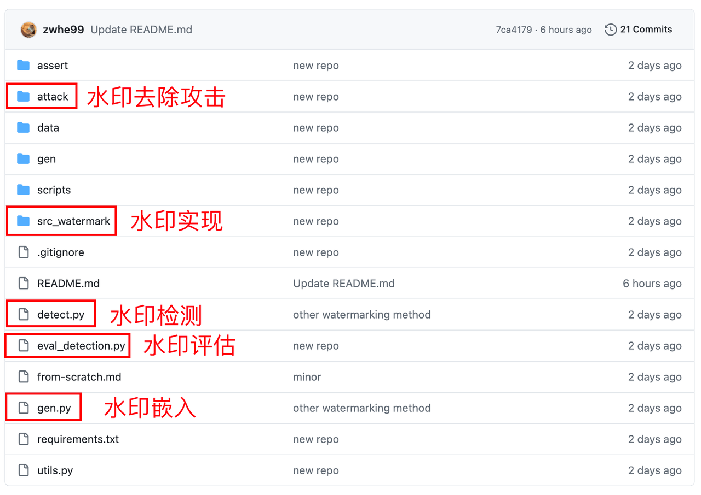
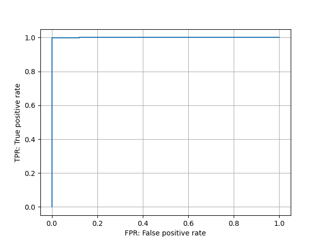

# 动手学大模型：模型水印

导读: 该部分介绍语言模型的水印

> 在语言模型生成的内容中嵌入人类无法察觉，但却可以被算法检测的到的“水印”。

## 本教程目标

1. 水印嵌入：在语言模型生成内容时嵌入水印
2. 水印检测：检测给定文本的水印强度
3. 水印评估：评估水印方法的检测性能
4. 评估水印的鲁棒性（可选）


## 准备工作

### 2.1 了解X-SIR代码仓库

https://github.com/zwhe99/X-SIR

X-SIR仓库包含以下内容的实现

- 三种文本水印算法：X-SIR, SIR和KGW
- 两种水印去除攻击方法：paraphrase和translation



### 2.2 环境准备

```Shell
git clone https://github.com/zwhe99/X-SIR && cd X-SIR
conda create -n xsir python==3.10.10
conda activate xsir
pip3 install -r requirements.txt
# [optional] pip3 install flash-attn==2.3.3
```

> requirements.txt里的版本均为建议版本，并非强制要求。


## 实操案例

> 使用KGW算法在语言模型生成内容中嵌入水印

### 3.1 数据准备

将待输入给语言模型的提示（prompt）组织成jsonl文件：

```JSON
{"prompt": "Ghost of Emmett Till: Based on Real Life Events "}
{"prompt": "Antique Cambridge Glass Pink Decagon Console Bowl Engraved Gold Highlights\n"}
{"prompt": "2009 > Information And Communication Technology Index statistics - Countries "}
......
```

- 每行是一个json object，并至少包含名为“prompt”的键
- 后续内容以`data/dataset/mc4/mc4.en.jsonl`文件为例。此文件一共包含500条数据，如果觉得模型处理时间过长，可以考虑自行缩减数据。

### 3.2 水印嵌入

- 选择模型和水印算法。这里我们选择`baichuan-inc/Baichuan-7B`模型，以及`KGW`水印算法

  - ```Shell
    MODEL_NAME=baichuan-inc/Baichuan-7B
    MODEL_ABBR=baichuan-7b
    WATERMARK_METHOD_FLAG="--watermark_method kgw"
    ```

- 生成内容，并嵌入水印

  - ```Shell
    python3 gen.py \
        --base_model $MODEL_NAME \
        --fp16 \
        --batch_size 32 \
        --input_file data/dataset/mc4/mc4.en.jsonl \
        --output_file gen/$MODEL_ABBR/kgw/mc4.en.mod.jsonl \
        $WATERMARK_METHOD_FLAG
    ```

  - 此命令将模型生成的内容保存至输出文件：`gen/$MODEL_ABBR/kgw/mc4.en.mod.jsonl`

  - 输出文件的格式如下，其中response为模型的输出内容：

    - ```JSON
      {"prompt": "Ghost of Emmett Till: Based on Real Life Events ", "response": ".In August if 1955 African American Emmett Louis Till (21)\nThe second part of The Man From Waco, about Dan Millers trial for murdering his friend Michael Capps in a Texas wiener wrastle as I believe the statute says called it then; back at that time that would have surely occurred since Dan kept his pistol in one of those watery doggy bags he keeps around to clean himself with after emptying can into a nearby lake just minutes before committing his crime. If what we read is true thats exactly where Dan left his stolen gun and later used it in the robbery gone wrong which killed two innocent boys when his own accomplice got into an argument over not being paid enough therefore wanting out. This angered Miller whos history of mental instability could be taken one way or another but this criminal act was unavoidable once they entered FBIs hands and some other very powerful law officers who were involved either directly"}
      {"prompt": "Antique Cambridge Glass Pink Decagon Console Bowl Engraved Gold Highlights\n", "response": "An exceptionally fine decorative antique pink decagonal glass side bowl is the perfect example of early art and innovation . Fully engraved, this beautiful English vintage tableware piece exhibits a great degree on craftsmanship! Made in England during the mid 1800's it features three sets of concentric ribbons on the exterior to elegantly highlight an intricate, deep reddish color which evokes warmth and comfort for years to come! This historically significant vase has been featured within numerous museum exhibitions including \"Glass at The Corning Museum\" ; \"The First Half Century\" & a special travelling exhibit called:\" Sight Of Glass: British Cut Glass\" by ibex limited (retailer) as well as \"SIGNALS - Celebrating History In American Silver Through The Articulated Bottle Vessel\" presented at the Corning Museum of Glass 2012 ASA national symposium! We provide our customers with quality phot"}
      {"prompt": "2009 > Information And Communication Technology Index statistics - Countries ", "response": "5/22/2016\nAnnual change of mobile telephone subscriptions in Armenia (per 1 population). 2.2% increase is equivalent to 38 subscriptions per 100 people. Density rank: 121 out of 222.\nCyclist(s)/month(S). Likes bike riding? Take advantage of discount and cheap rental bikes at Rimon Bike Rentals in Yerevan! No advance payments or additional deposits are required. They have a good range of bicycles, including mountainbikes. More on their Facebook page \nYou must know about electric cars. The Renault Fluence KZERO gets it right in the city but I'm not sure what mileage you can expect from it. Still its fun project http://www.renault-kzen.com\nFor more on this and related issues : Armenian Institute for Electronic Governance reports |"}
      ......
      ```


### 3.3 水印检测

> 水印检测即给定一段文本，计算该段文本的水印强度（z-score）。

- 计算**有水印**文本的水印强度

  - ```python
    python3 detect.py \
        --base_model $MODEL_NAME \
        --detect_file gen/$MODEL_ABBR/kgw/mc4.en.mod.jsonl \
        --output_file gen/$MODEL_ABBR/kgw/mc4.en.mod.z_score.jsonl \
        $WATERMARK_METHOD_FLAG
    ```

- 计算**无水印**文本的水印强度

  - ```python
    python3 detect.py \
        --base_model $MODEL_NAME \
        --detect_file data/dataset/mc4/mc4.en.jsonl \
        --output_file gen/$MODEL_ABBR/kgw/mc4.en.hum.z_score.jsonl \
        $WATERMARK_METHOD_FLAG
    ```

- 输出的文件格式为：

  - ```JSON
    {"z_score": 12.105422509165574, "prompt": "Ghost of Emmett Till: Based on Real Life Events ", "response": ".In August if 1955 African American Emmett Louis Till (21)\nThe second part of The Man From Waco, about Dan Millers trial for murdering his friend Michael Capps in a Texas wiener wrastle as I believe the statute says called it then; back at that time that would have surely occurred since Dan kept his pistol in one of those watery doggy bags he keeps around to clean himself with after emptying can into a nearby lake just minutes before committing his crime. If what we read is true thats exactly where Dan left his stolen gun and later used it in the robbery gone wrong which killed two innocent boys when his own accomplice got into an argument over not being paid enough therefore wanting out. This angered Miller whos history of mental instability could be taken one way or another but this criminal act was unavoidable once they entered FBIs hands and some other very powerful law officers who were involved either directly", "biases": null}
    {"z_score": 12.990684249887122, "prompt": "Antique Cambridge Glass Pink Decagon Console Bowl Engraved Gold Highlights\n", "response": "An exceptionally fine decorative antique pink decagonal glass side bowl is the perfect example of early art and innovation . Fully engraved, this beautiful English vintage tableware piece exhibits a great degree on craftsmanship! Made in England during the mid 1800's it features three sets of concentric ribbons on the exterior to elegantly highlight an intricate, deep reddish color which evokes warmth and comfort for years to come! This historically significant vase has been featured within numerous museum exhibitions including \"Glass at The Corning Museum\" ; \"The First Half Century\" & a special travelling exhibit called:\" Sight Of Glass: British Cut Glass\" by ibex limited (retailer) as well as \"SIGNALS - Celebrating History In American Silver Through The Articulated Bottle Vessel\" presented at the Corning Museum of Glass 2012 ASA national symposium! We provide our customers with quality phot", "biases": null}
    {"z_score": 11.455466938203664, "prompt": "2009 > Information And Communication Technology Index statistics - Countries ", "response": "5/22/2016\nAnnual change of mobile telephone subscriptions in Armenia (per 1 population). 2.2% increase is equivalent to 38 subscriptions per 100 people. Density rank: 121 out of 222.\nCyclist(s)/month(S). Likes bike riding? Take advantage of discount and cheap rental bikes at Rimon Bike Rentals in Yerevan! No advance payments or additional deposits are required. They have a good range of bicycles, including mountainbikes. More on their Facebook page \nYou must know about electric cars. The Renault Fluence KZERO gets it right in the city but I'm not sure what mileage you can expect from it. Still its fun project http://www.renault-kzen.com\nFor more on this and related issues : Armenian Institute for Electronic Governance reports |", "biases": null}
    ......
    ```

- 肉眼查看一下两个文件水印强度的区别

### 3.4 水印评估
<a name="eval"></a>

- 输入水印检测的z-score文件，计算检测准确度，绘制ROC曲线

  - ```Shell
    python3 eval_detection.py \
            --hm_zscore gen/$MODEL_ABBR/kgw/mc4.en.hum.z_score.jsonl \
            --wm_zscore gen/$MODEL_ABBR/kgw/mc4.en.mod.z_score.jsonl \
            --roc_curve roc
    
    AUC: 1.000
    
    TPR@FPR=0.1: 0.998
    TPR@FPR=0.01: 0.998
    
    F1@FPR=0.1: 0.999
    F1@FPR=0.01: 0.999
    ```



## 评估水印的鲁棒性（可选）

> 对水印文本进行paraphrase和translation攻击后，重新评估其检测效果

### 4.1 准备工作

我们使用gpt-3.5-turbo-1106模型对水印文本进行paraphrase和translation。也可以自行选择其它工具。

- 设置openai的apikey

  - ```Shell
    export OPENAI_API_KEY=xxxx
    ```

- 修改`attack/const.py`中的RPM (requests per min) and TPM (tokens per min)

### 4.2 进行攻击（以翻译为例）

- 将水印文本翻译成中文

  - ```Shell
    python3 attack/translate.py \
        --input_file gen/$MODEL_ABBR/kgw/mc4.en.mod.jsonl \
        --output_file gen/$MODEL_ABBR/kgw/mc4.en-zh.mod.jsonl \
        --model gpt-3.5-turbo-1106 \
        --src_lang en \
        --tgt_lang zh
    ```

- 重新评估

  -  见[3.4](#eval)

- 比较攻击前后水印性能的变化


## 进阶练习

- 查看[X-SIR](https://github.com/zwhe99/X-SIR)文档，学习使用其它两种（X-SIR，SIR）算法，并评估其在不同攻击方法下的性能