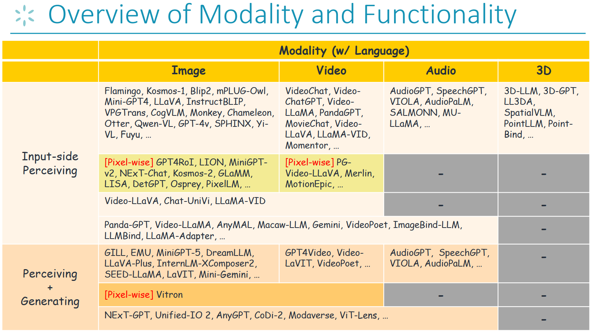
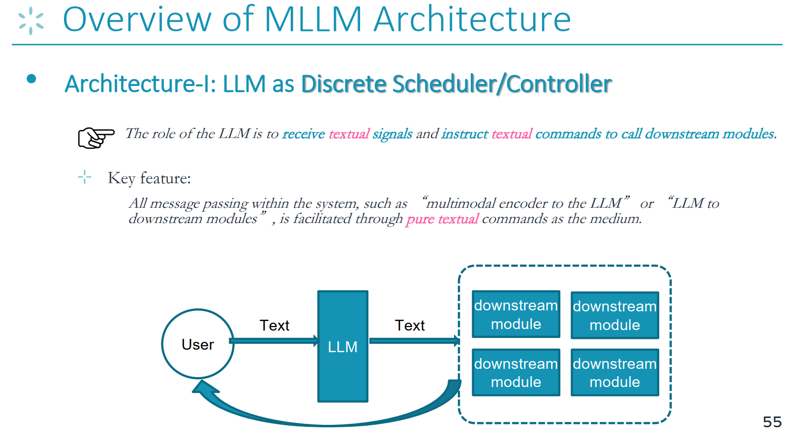
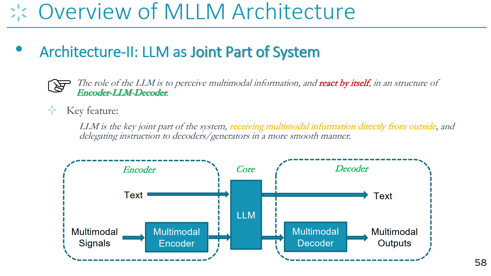
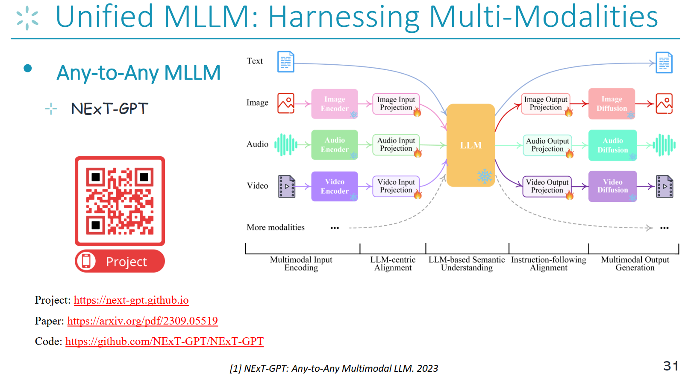
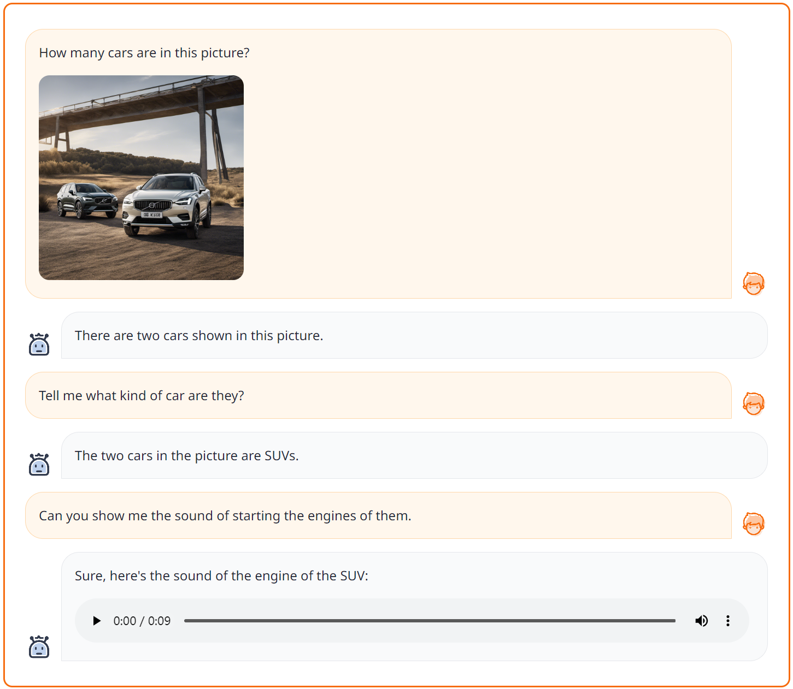
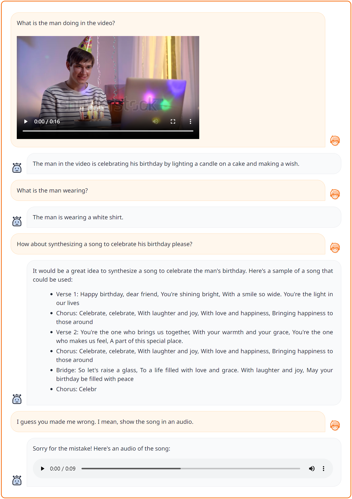
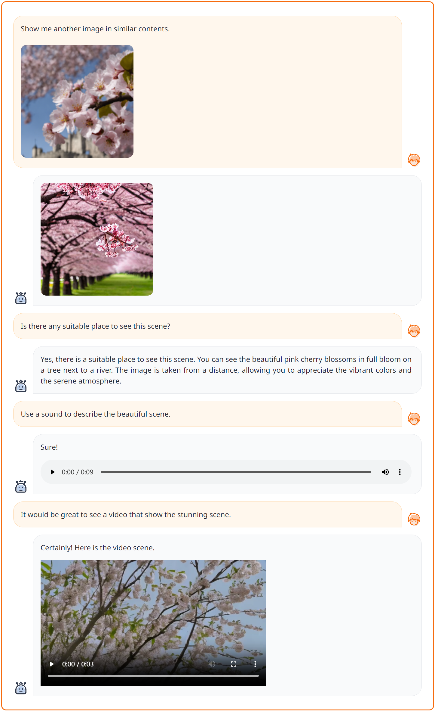
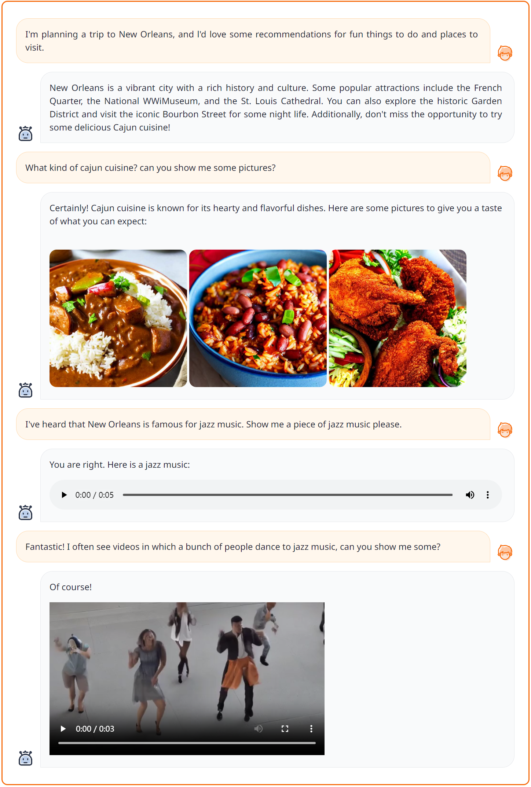

# 动手学大模型：多模态大语言模型

导读: 该部分介绍多模态大语言模型的常见架构以及构建方法

> 大语言模型的出现让大家看到，高阶的智能在语言模态上得到了充分的体现。作为能够更充分模拟真实世界的多模态大语言模型，其如何实现更强大的多模态理解和生成能力？多模态大语言模型是否能够帮助实现AGI？


大模型智能体迈向了未来操作系统之旅。然而，大模型在开放智能体场景中能意识到风险威胁吗？


## 本教程目标

1. 熟悉多模态大语言模型的类型
2. 掌握多模态大语言模型的通用技术框架
3. 掌握多模态大语言模型的搭建、训练和推理


## 1. 理论知识预备


### 1.1 了解多模态大语言模型的类型

- 现有多模态大语言模型的功能、模态支持分类


> 在构建多模态大语言模型（MLLM）之前，本领域的研究者们都达成了一个共识、一个关键前提：由于规模定律和新兴现象，当前基于语言的LLM已经具有了强大的语义理解能力，这意味着语言已经成为承载智能的关键模态，所以语言智能被认为是多模态智能的枢纽。因此，几乎所有的MLLM都是建立在基于语言的LLM之上的，我这LLM作为核心决策模块，类似于大脑或中央处理器。换句话说，通过添加额外的外部非文本模态模块或编码器，LLM被赋予了多模态感知/操作能力。

我们将现有的MLLM根据其模态支持、功能支持情况，划分为不同的类型。




- 阅读完整教程：[[Slides](https://github.com/Lordog/dive-into-llms/blob/main/documents/chapter6/mllms.pdf)] 


- 更多相关综述
    - [A Survey on Multimodal Large Language Models, https://github.com/BradyFU/Awesome-Multimodal-Large-Language-Models, 2023](https://github.com/BradyFU/Awesome-Multimodal-Large-Language-Models)
    - [MM-LLMs: Recent Advances in MultiModal Large Language Models, 2023](https://arxiv.org/pdf/2401.13601)


### 1.2 了解多模态大语言模型的通用技术框架


- 架构一：LLM as Task Scheduler

> 目前社区存在两种常见的MLLM架构。
第一种是“LLM作为离散调度器/控制器”的架构。如下图所示，LLM的角色是接收文本信号并向下游模块发出文本命令。系统内部的所有消息传递都是通过LLM输出的纯文本命令作为媒介进行的。不同的功能模块之间不存在交互。




- 架构二：LLM as Joint Part of System

> 第二种架构，编码器-LLM-解码器框架。
这也是目前最流行的架构。其中LLM的角色是感知多模态信息，并在一个编码器-LLM-解码器的结构中自行做出响应和操作。因此，这个架构跟第一章架构的关键区别在于：LLM作为系统的关键联合部分，直接从外部接收多模态信息，并以更顺畅的方式委派指令给解码器/生成器。在编码器-LLM-解码器框架中，如下图所示，编码器处理来自多个模态的编码信号，LLM充当核心决策者，而解码器管理多模态输出。




## 2. 上手实践通用多模态大语言模型

> 实践“任意模态到任意模态”的通用多模态大语言模型的构建过程


### 2.1 面向通用统一的“任意到任意模态”多模态大语言模型：NExT-GPT

> 未来的MLLM研究一定是朝着越来越通用的generalist方向发展，所以会包含尽可能多的模态、功能。NExT-GPT是这个领域的目前最为开创性的一项工作之一，其首次引入了“任意到任意模态”MLLM的概念。这种架构实现了强大的功能，为未来的多模态大语言模型的研究方向奠定了基础。




> 本次课程关于多模态大语言模型的代码实践部分，将会以NExT-GPT的代码为目标，进行深入浅出的分析和实践。

[NExT-GPT Project](https://next-gpt.github.io/)

[NExT-GPT GitHub 代码库](https://github.com/NExT-GPT/NExT-GPT)


### 2.2 代码框架浏览


```
├── figures
├── data
│   ├── T-X_pair_data  
│   │   ├── audiocap                      # text-autio pairs data
│   │   │   ├── audios                    # audio files
│   │   │   └── audiocap.json             # the audio captions
│   │   ├── cc3m                          # text-image paris data
│   │   │   ├── images                    # image files
│   │   │   └── cc3m.json                 # the image captions
│   │   └── webvid                        # text-video pairs data
│   │   │   ├── videos                    # video files
│   │   │   └── webvid.json               # the video captions
│   ├── IT_data                           # instruction data
│   │   ├── T+X-T_data                    # text+[image/audio/video] to text instruction data
│   │   │   ├── alpaca                    # textual instruction data
│   │   │   ├── llava                     # visual instruction data
│   │   ├── T-T+X                         # synthesized text to text+[image/audio/video] instruction data
│   │   └── MosIT                         # Modality-switching Instruction Tuning instruction data
├── code
│   ├── config
│   │   ├── base.yaml                     # the model configuration 
│   │   ├── stage_1.yaml                  # enc-side alignment training configuration
│   │   ├── stage_2.yaml                  # dec-side alignment training configuration
│   │   └── stage_3.yaml                  # instruction-tuning configuration
│   ├── dsconfig
│   │   ├── stage_1.json                  # deepspeed configuration for enc-side alignment training
│   │   ├── stage_2.json                  # deepspeed configuration for dec-side alignment training
│   │   └── stage_3.json                  # deepspeed configuration for instruction-tuning training
│   ├── datast
│   │   ├── base_dataset.py
│   │   ├── catalog.py                    # the catalog information of the dataset
│   │   ├── cc3m_datast.py                # process and load text-image pair dataset
│   │   ├── audiocap_datast.py            # process and load text-audio pair dataset
│   │   ├── webvid_dataset.py             # process and load text-video pair dataset
│   │   ├── T+X-T_instruction_dataset.py  # process and load text+x-to-text instruction dataset
│   │   ├── T-T+X_instruction_dataset.py  # process and load text-to-text+x instruction dataset
│   │   └── concat_dataset.py             # process and load multiple dataset
│   ├── model                     
│   │   ├── ImageBind                     # the code from ImageBind Model
│   │   ├── common
│   │   ├── anyToImageVideoAudio.py       # the main model file
│   │   ├── agent.py
│   │   ├── modeling_llama.py
│   │   ├── custom_ad.py                  # the audio diffusion 
│   │   ├── custom_sd.py                  # the image diffusion
│   │   ├── custom_vd.py                  # the video diffusion
│   │   ├── layers.py                     # the output projection layers
│   │   └── ...  
│   ├── scripts
│   │   ├── train.sh                      # training NExT-GPT script
│   │   └── app.sh                        # deploying demo script
│   ├── header.py
│   ├── process_embeddings.py             # precompute the captions embeddings
│   ├── train.py                          # training
│   ├── inference.py                      # inference
│   ├── demo_app.py                       # deploy Gradio demonstration 
│   └── ...
├── ckpt                           
│   ├── delta_ckpt                        # tunable NExT-GPT params
│   │   ├── nextgpt         
│   │   │   ├── 7b_tiva_v0                # the directory to save the log file
│   │   │   │   ├── log                   # the logs
│   └── ...       
│   ├── pretrained_ckpt                   # frozen params of pretrained modules
│   │   ├── imagebind_ckpt
│   │   │   ├──huge                       # version
│   │   │   │   └──imagebind_huge.pth
│   │   ├── vicuna_ckpt
│   │   │   ├── 7b_v0                     # version
│   │   │   │   ├── config.json
│   │   │   │   ├── pytorch_model-00001-of-00002.bin
│   │   │   │   ├── tokenizer.model
│   │   │   │   └── ...
├── LICENCE.md
├── README.md
└── requirements.txt
```


### 2.3 安装环境

请先克隆仓库并安装所需的环境，可以通过运行以下命令来完成环境的安装：

```
conda env create -n nextgpt python=3.8

conda activate nextgpt

# CUDA 11.6
conda install pytorch==1.13.1 torchvision==0.14.1 torchaudio==0.13.1 pytorch-cuda=11.6 -c pytorch -c nvidia

git clone https://github.com/NExT-GPT/NExT-GPT.git
cd NExT-GPT

pip install -r requirements.txt
```


### 2.4 系统推理上手


#### 2.4.1 加载预训练的NExT-GPT模型checkpoint

- **步骤1**：加载`冻结参数`。[NExT-GPT](https://github.com/NExT-GPT/NExT-GPT) 是基于以下现有模型或模块进行训练的, 请按照以下说明准备checkpoint。
    - `ImageBind` 是统一的图像/视频/音频编码器。可以从[此处](https://dl.fbaipublicfiles.com/imagebind/imagebind_huge.pth)下载预训练检查点，版本为`huge`。然后，将`imagebind_huge.pth`文件放置在[[./ckpt/pretrained_ckpt/imagebind_ckpt/huge]](ckpt/pretrained_ckpt/imagebind_ckpt/)。
    - `Vicuna`：首先按照[[这里]](ckpt/pretrained_ckpt/prepare_vicuna.md)的说明准备LLaMA。然后将预训练模型放置在[[./ckpt/pretrained_ckpt/vicuna_ckpt/]](ckpt/pretrained_ckpt/vicuna_ckpt/)。
    - `Image Diffusion` 用于生成图像。NExT-GPT 使用版本为`v1-5`的[Stable Diffusion](https://huggingface.co/runwayml/stable-diffusion-v1-5)。(_代码里将会自动下载_)
    - `Audio Diffusion` 用于生成音频内容。NExT-GPT 使用版本为`l-full`的[AudioLDM](https://github.com/haoheliu/AudioLDM)。(_代码里将会自动下载_)
    - `Video Diffusion` 用于视频生成。我们使用版本为`v2_576w`的[ZeroScope](https://huggingface.co/cerspense/zeroscope_v2_576w)。(_代码里将会自动下载_)

- **步骤2**：加载`可调参数`。

将NExT-GPT系统放置在[[./ckpt/delta_ckpt/nextgpt/7b_tiva_v0]](./ckpt/delta_ckpt/nextgpt/7b_tiva_v0)。可以选择 1) 使用自己训练的参数，或者 2) 从[Huggingface](https://huggingface.co/ChocoWu/nextgpt_7b_tiva_v0)下载预训练好的checkpoint。


#### 2.4.2 Gradio Demo部署

完成检查点加载后，您可以通过以下方式在本地运行演示：
```angular2html
cd ./code
bash scripts/app.sh
```
指定关键参数如下：
- `--nextgpt_ckpt_path`：预训练NExT-GPT参数的路径。


#### 2.4.3 测试示例实践

目前的版本能够支持文字、图像、视频、声音四种模态下任意组合的输入，并任务组合模态的输出。
并且支持多轮上下文交互。

请各位自行运行测试效果。

- **Case-1**：输入T+I，输出T+A




- **Case-2**：输入T+V，输出T+A




- **Case-3**：输入T+I，输出T+I+V




- **Case-4**：输入T，输出T+I+V+A




### 2.5 系统训练过程


#### 2.5.1 数据准备

请下载以下用于模型训练的数据集：

A) T-X对数据
  - ***文本-图像*** 对的 `CC3M` 数据，请按照此说明操作[[here]](./data/T-X_pair_data/cc3m/prepare.md)。然后将数据放置在[[./data/T-X_pair_data/cc3m]](./data/T-X_pair_data/cc3m)。
  - ***文本-视频*** 对的 `WebVid` 数据，参考[[instruction]](./data/T-X_pair_data/webvid/prepare.md)。文件应保存在[[./data/T-X_pair_data/webvid]](./data/T-X_pair_data/webvid)。
  - ***文本-音频*** 对的 `AudioCap` 数据，参考[[instruction]](./data/T-X_pair_data/audiocap/prepare.md)。将数据保存在[[./data/T-X_pair_data/audiocap]](./data/T-X_pair_data/audiocap)。

B) 指令微调数据
  - T+X-T
    - ***视觉指令数据*** (from `LLaVA`)，从[此处](https://github.com/haotian-liu/LLaVA/blob/main/docs/Data.md)下载，并将其放置在[[./data/IT_data/T+X-T_data/llava]](./data/IT_data/T+X-T_data/llava/)。
    - ***文本指令数据*** (from `Alpaca`)，从[此处](https://github.com/tatsu-lab/stanford_alpaca)下载，并将其放置在[[./data/IT_data/T+X-T_data/alpaca/]](data/IT_data/T+X-T_data/alpaca/)。
    - ***视频指令数据*** (from `VideoChat`)，从[此处](https://github.com/OpenGVLab/InternVideo/tree/main/Data/instruction_data)下载，并将其放置在[[./data/IT_data/T+X-T_data/videochat/]](data/IT_data/T+X-T_data/videochat/)。

    注意：下载数据集后，请运行 `preprocess_dataset.py` 对数据集进行预处理，使其格式统一。
  - T-X+T (T2M)
    - `T-X+T` 指令数据集（T2M）保存在[[./data/IT_data/T-T+X_data]](./data/IT_data/T-T+X_data)。
   
  - MosIT
    - 从[这里](./data/IT_data/MosIT_data/)获得下载数据的说明。最终将其放置在[[./data/IT_data/MosIT_data/]](./data/IT_data/MosIT_data/)。


#### 2.5.2 嵌入向量准备

在NExT-GPT的解码端的对齐训练中，我们最小化Signal Token和captions的表征之间的距离。为了保证系统的高效率，节省时间和内存成本，我们使用各个扩散模型中的文本编码器预计算图像、音频和视频标题的文本嵌入。

在进行NExT-GPT的训练之前，请运行以下命令，生成的 `embedding` 文件将保存在[[./data/embed]](./data/embed)。
```
cd ./code/
python process_embeddings.py ../data/T-X_pair_data/cc3m/cc3m.json image ../data/embed/ runwayml/stable-diffusion-v1-5
```


参数说明：
- args[1]: 标题文件路径；
- args[2]: 模态，可以是 `image`、`video` 和 `audio`；
- args[3]: 嵌入向量文件保存路径；
- args[4]: 相应的预训练扩散模型名称。


#### 2.5.3 三阶段式训练


首先参考基础配置文件[[./code/config/base.yaml]](./code/config/base.yaml)，了解整个模块的基本系统设置。

然后运行以下脚本开始NExT-GPT的训练：
```
cd ./code
bash scripts/train.sh
```

指定命令如下：
```
deepspeed --include localhost:0 --master_addr 127.0.0.1 --master_port 28459 train.py \
    --model nextgpt \
    --stage 1\
    --save_path  ../ckpt/delta_ckpt/nextgpt/7b_tiva_v0/\
    --log_path ../ckpt/delta_ckpt/nextgpt/7b_tiva_v0/log/
```
其中关键参数：
- `--include`: `localhost:0` 表示深度速度中的 GPT cuda 编号 `0`。
- `--stage`: 训练阶段。
- `--save_path`: 存储训练后的 delta 权重的目录。此目录将自动创建。
- `--log_path`: 存储日志文件的目录。


NExT-GPT的整个训练分为3个步骤：

- **步骤1**：编码端LLM为中心的多模态对齐。该阶段训练***输入投影层***，同时冻结ImageBind、LLM和输出投影层。
  
  只需运行上述的`train.sh`脚本，并设置：`--stage 1`
  
  还请参考运行配置文件[[./code/config/stage_1.yaml]](./code/config/stage_1.yaml)和deepspeed配置文件[[./code/dsconfig/stage_1.yaml]](./code/dsconfig/stage_1.yaml)以获取更多逐步配置信息。

  请注意，在此步骤中使用的数据集包含在`dataset_name_list`中，并且数据集名称必须与[[./code/dataset/catalog.py]](./code/dataset/catalog.py)中的定义精确匹配。


- **步骤2**：解码端指令跟随对齐。该阶段训练***输出投影层***，同时冻结ImageBind、LLM和输入投影层。

  只需运行上述的`train.sh`脚本，并设置：`--stage 2`

  还请参考运行配置文件[[./code/config/stage_2.yaml]](./code/config/stage_2.yaml)和deepspeed配置文件[[./code/dsconfig/stage_2.yaml]](./code/dsconfig/stage_2.yaml)以获取更多逐步配置信息。


- **步骤3**：指令调整。该阶段对指令数据集进行以下调整：1) 通过LoRA调整***LLM***，2) 调整***输入投影层***和3) 调整***输出投影层***。

  只需运行上述的`train.sh`脚本，并设置：`--stage 3`

  还请参考运行配置文件[[./code/config/stage_3.yaml]](./code/config/stage_3.yaml)和deepspeed配置文件[[./code/dsconfig/stage_3.yaml]](./code/dsconfig/stage_3.yaml)以获取更多逐步配置信息。
