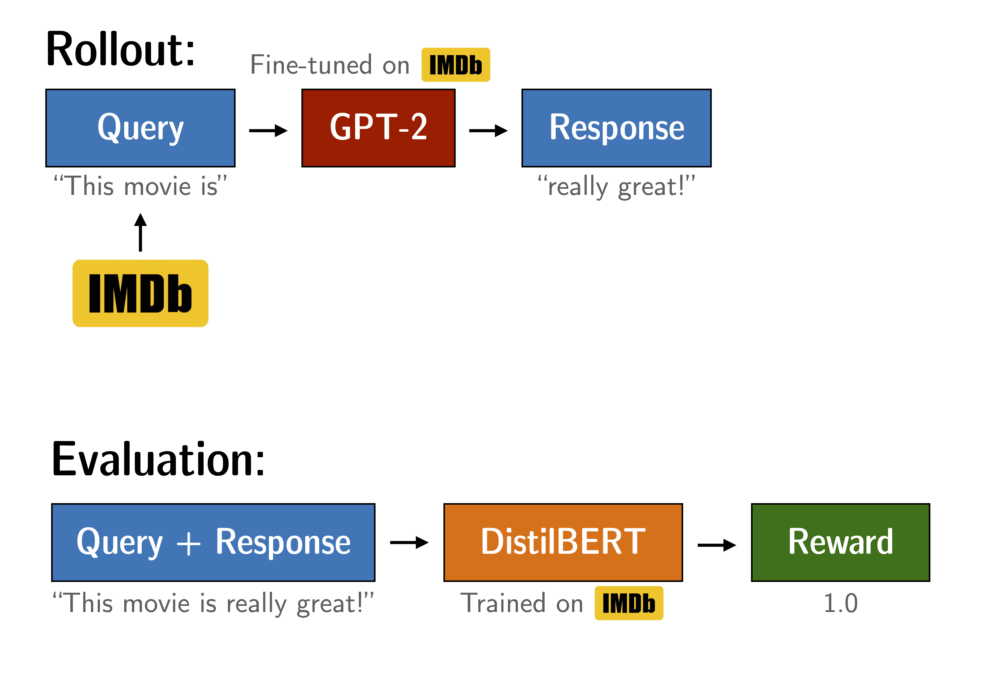
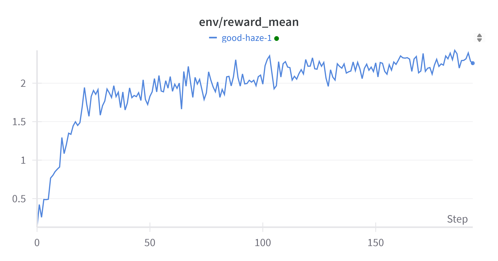

# 动手学大模型：RLHF

> 本实验手册翻译并整合了网络资料 [blog](https://newfacade.github.io/notes-on-reinforcement-learning/17-ppo-trl.html) & [trl examples](https://github.com/huggingface/trl/blob/main/examples/notebooks/gpt2-sentiment.ipynb)

复现实验配置：单卡 NVDIA A800-SXM4-80GB 占用 10097MiB，训练耗时 35min19s。

阅读教程：[slide](./RLHF.pdf)

notebook：[notebook](./RLHF.ipynb)

## PPO 如何运作
1. Rollout：语言模型根据 query 生成响应。
2. Evaluation：查询和响应使用函数、模型、人工反馈或它们的某种组合进行评估。此过程应为每个查询/响应对生成一个**标量值**。
3. Optimization：在优化步骤中，查询/响应对用于计算序列中标记的对数概率。这是通过训练的模型和参考模型完成的。两个输出之间的 KL 散度用作额外的奖励信号，以确保生成的响应不会偏离参考语言模型太远。然后使用 PPO 训练主动语言模型。
<div style="text-align: center">

<p style="text-align: center;"> <b>图:</b> PPO 流程图 </p>
</div>

# 微调 GPT-2 以生成积极评论  
> 通过使用 BERT 情感分类器作为奖励函数，优化 GPT-2 以生成积极的 IMDB 电影评论。

<div style="text-align: center">

<p style="text-align: center;"> <b>图：</b> 微调 GPT-2 的实验设置</p>
</div>

我们微调 GPT-2 以基于 IMDB 数据集生成积极的电影评论。该模型会接收真实评论的开头部分，并需要生成积极的后续内容。为了奖励积极的后续内容，我们使用 BERT 分类器来分析生成句子的情感，并将分类器的输出作为 PPO 训练的奖励信号。

## 实验设置

### 下载模型和数据
数据集
```bash
export HF_ENDPOINT=https://hf-mirror.com; huggingface-cli download --resume-download stanfordnlp/imdb --local-dir dataset/imdb --repo-type dataset
```
参考模型
```bash
export HF_ENDPOINT=https://hf-mirror.com; huggingface-cli download --resume-download lvwerra/gpt2-imdb --local-dir model/gpt2-imdb
```
奖励模型
```bash
export HF_ENDPOINT=https://hf-mirror.com; huggingface-cli download --resume-download lvwerra/distilbert-imdb --local-dir model/distilbert-imdb
```

### 导入依赖项


```python
# %pip install -r requirements.txt
# import os
# os.environ['CUDA_VISIBLE_DEVICES'] = '7'
```


```python
import torch
from tqdm import tqdm
import pandas as pd

tqdm.pandas()

from transformers import pipeline, AutoTokenizer
from datasets import load_dataset

from trl import PPOTrainer, PPOConfig, AutoModelForCausalLMWithValueHead
from trl.core import LengthSampler
```

### 配置


```python
config = PPOConfig(
    model_name="model/gpt2-imdb",
    learning_rate=1.41e-5,
    log_with="wandb",
)

sent_kwargs = {"top_k": None, "function_to_apply": "none", "batch_size": 16}
```


```python
import wandb

wandb.init()
```

你可以看到我们加载了一个名为 `gpt2_imdb` 的 GPT-2 模型。该模型在 IMDB 数据集上额外微调了 1 个 epoch，使用的是 Hugging Face 的[脚本](https://github.com/huggingface/transformers/blob/main/examples/legacy/run_language_modeling.py)（无特殊设置）。其余参数主要取自原始论文《[Fine-Tuning Language Models from Human Preferences](https://huggingface.co/papers/1909.08593)》。该模型以及 BERT 模型均可在 Hugging Face 的模型库中获取，具体链接在[这里](https://huggingface.co/models)。

## 加载数据和模型

### 加载 IMDB 数据集  
IMDB 数据集包含了 50,000 条电影评论，并标注了“积极”/“消极”的情感反馈。我们将 IMDB 数据集加载到一个 DataFrame 中，并筛选出至少 200 个字符的评论。然后，我们对每条文本进行分词，并使用 `LengthSampler` 将其随机截断为指定长度。


```python
def build_dataset(
    config,
    dataset_name="dataset/imdb",
    input_min_text_length=2,
    input_max_text_length=8,
):
    """
    Build dataset for training. This builds the dataset from `load_dataset`, one should
    customize this function to train the model on its own dataset.

    Args:
        dataset_name (`str`):
            The name of the dataset to be loaded.

    Returns:
        dataloader (`torch.utils.data.DataLoader`):
            The dataloader for the dataset.
    """
    tokenizer = AutoTokenizer.from_pretrained(config.model_name)
    tokenizer.pad_token = tokenizer.eos_token
    # load imdb with datasets
    ds = load_dataset(dataset_name, split="train")
    ds = ds.rename_columns({"text": "review"})
    ds = ds.filter(lambda x: len(x["review"]) > 200, batched=False)

    input_size = LengthSampler(input_min_text_length, input_max_text_length)

    def tokenize(sample):
        sample["input_ids"] = tokenizer.encode(sample["review"])[: input_size()]
        sample["query"] = tokenizer.decode(sample["input_ids"])
        return sample

    ds = ds.map(tokenize, batched=False)
    ds.set_format(type="torch")
    return ds
```


```python
dataset = build_dataset(config)


def collator(data):
    return dict((key, [d[key] for d in data]) for key in data[0])
```

### 加载预训练的 GPT2 语言模型
我们加载带有值头（value head）的 GPT2 模型和分词器。我们加载了两次模型；第一个模型用于优化，而第二个模型作为参考，用于计算与初始点的 KL 散度（KL-divergence）。这在 PPO 训练中作为额外的奖励信号，以确保优化后的模型不会偏离原始语言模型太远。


```python
model = AutoModelForCausalLMWithValueHead.from_pretrained(config.model_name)
ref_model = AutoModelForCausalLMWithValueHead.from_pretrained(config.model_name)
tokenizer = AutoTokenizer.from_pretrained(config.model_name)

tokenizer.pad_token = tokenizer.eos_token
```

### 初始化 PPOTrainer  
`PPOTrainer` 负责后续的设备分配和优化：


```python
ppo_trainer = PPOTrainer(
    config, model, ref_model, tokenizer, dataset=dataset, data_collator=collator
)
```


### 加载 BERT 分类器  
我们加载了一个在 IMDB 数据集上微调过的 BERT 分类器。


```python
device = ppo_trainer.accelerator.device
if ppo_trainer.accelerator.num_processes == 1:
    device = 0 if torch.cuda.is_available() else "cpu"  # to avoid a `pipeline` bug
sentiment_pipe = pipeline(
    "sentiment-analysis", model="model/distilbert-imdb", device=device
)
```

    Device set to use cuda:0


模型输出的是负面类和正面类的 logits。我们将使用正面类的 logits 作为语言模型的奖励信号。


```python
text = "this movie was really bad!!"
sentiment_pipe(text, **sent_kwargs)
```


    [{'label': 'NEGATIVE', 'score': 2.3350484371185303},
     {'label': 'POSITIVE', 'score': -2.726576089859009}]


```python
text = "this movie was really good!!"
sentiment_pipe(text, **sent_kwargs)
```


    [{'label': 'POSITIVE', 'score': 2.557040214538574},
     {'label': 'NEGATIVE', 'score': -2.294790267944336}]


### 生成设置  
对于响应生成，我们仅使用采样方法，并确保关闭 top-k 和核采样（nucleus sampling），同时设置一个最小长度。


```python
gen_kwargs = {
    "min_length": -1,
    "top_k": 0.0,
    "top_p": 1.0,
    "do_sample": True,
    "pad_token_id": tokenizer.eos_token_id,
}
```

## 优化模型

### 训练循环

训练循环包括以下主要步骤：
1. 从策略网络（GPT-2）中获取查询响应  
2. 从 BERT 中获取查询/响应的情感  
3. 使用 PPO 优化策略，利用（查询、响应、奖励）三元组  


```python
output_min_length = 4
output_max_length = 16
output_length_sampler = LengthSampler(output_min_length, output_max_length)


generation_kwargs = {
    "min_length": -1,
    "top_k": 0.0,
    "top_p": 1.0,
    "do_sample": True,
    "pad_token_id": tokenizer.eos_token_id,
}


for epoch, batch in enumerate(tqdm(ppo_trainer.dataloader)):
    query_tensors = batch["input_ids"]

    #### Get response from gpt2
    response_tensors = []
    for query in query_tensors:
        gen_len = output_length_sampler()
        generation_kwargs["max_new_tokens"] = gen_len
        query_response = ppo_trainer.generate(query, **generation_kwargs).squeeze()
        response_len = len(query_response) - len(query)
        response_tensors.append(query_response[-response_len:])
    batch["response"] = [tokenizer.decode(r.squeeze()) for r in response_tensors]

    #### Compute sentiment score
    texts = [q + r for q, r in zip(batch["query"], batch["response"])]
    pipe_outputs = sentiment_pipe(texts, **sent_kwargs)
    positive_scores = [
        item["score"]
        for output in pipe_outputs
        for item in output
        if item["label"] == "POSITIVE"
    ]
    rewards = [torch.tensor(score) for score in positive_scores]

    #### Run PPO step
    stats = ppo_trainer.step(query_tensors, response_tensors, rewards)
    ppo_trainer.log_stats(stats, batch, rewards)
```

      0%|          | 0/194 [00:00<?, ?it/s]The attention mask is not set and cannot be inferred from input because pad token is same as eos token. As a consequence, you may observe unexpected behavior. Please pass your input's `attention_mask` to obtain reliable results.
      4%|▍         | 8/194 [01:23<32:18, 10.42s/it]You seem to be using the pipelines sequentially on GPU. In order to maximize efficiency please use a dataset
    100%|██████████| 194/194 [35:19<00:00, 10.92s/it]


### 训练进展  
如果你正在使用 Weights & Biases 跟踪训练进展，你应该会看到类似于下图的曲线。查看 wandb.ai 上的交互式示例报告：[链接](https://wandb.ai/huggingface/trl/runs/w9l3110g)。  
<div style="text-align: center">

<p style="text-align: center;"> <b>图：</b> 训练期间奖励均值的演变 </p>
</div>  
可以观察到，经过几次优化步骤后，模型开始生成更积极的输出。  

## 模型检查  
让我们从 IMDB 数据集中检查一些示例。我们可以使用 `ref_model` 来比较优化后的模型 `model` 与优化前的模型。


```python
#### get a batch from the dataset
bs = 16
game_data = dict()
dataset.set_format("pandas")
df_batch = dataset[:].sample(bs)
game_data["query"] = df_batch["query"].tolist()
query_tensors = df_batch["input_ids"].tolist()

response_tensors_ref, response_tensors = [], []

#### get response from gpt2 and gpt2_ref
for i in range(bs):
    query = torch.tensor(query_tensors[i]).to(device)

    gen_len = output_length_sampler()
    query_response = ref_model.generate(
        query.unsqueeze(0), max_new_tokens=gen_len, **gen_kwargs
    ).squeeze()
    response_len = len(query_response) - len(query)
    response_tensors_ref.append(query_response[-response_len:])

    query_response = model.generate(
        query.unsqueeze(0), max_new_tokens=gen_len, **gen_kwargs
    ).squeeze()
    response_len = len(query_response) - len(query)
    response_tensors.append(query_response[-response_len:])

#### decode responses
game_data["response (before)"] = [
    tokenizer.decode(response_tensors_ref[i]) for i in range(bs)
]
game_data["response (after)"] = [
    tokenizer.decode(response_tensors[i]) for i in range(bs)
]

#### sentiment analysis of query/response pairs before/after
texts = [q + r for q, r in zip(game_data["query"], game_data["response (before)"])]
pipe_outputs = sentiment_pipe(texts, **sent_kwargs)
positive_scores = [
    item["score"]
    for output in pipe_outputs
    for item in output
    if item["label"] == "POSITIVE"
]
game_data["rewards (before)"] = positive_scores

texts = [q + r for q, r in zip(game_data["query"], game_data["response (after)"])]
pipe_outputs = sentiment_pipe(texts, **sent_kwargs)
positive_scores = [
    item["score"]
    for output in pipe_outputs
    for item in output
    if item["label"] == "POSITIVE"
]
game_data["rewards (after)"] = positive_scores

# store results in a dataframe
df_results = pd.DataFrame(game_data)
df_results
```

<table border="1" class="dataframe">
  <thead>
    <tr style="text-align: right;">
      <th></th>
      <th>query</th>
      <th>response (before)</th>
      <th>response (after)</th>
      <th>rewards (before)</th>
      <th>rewards (after)</th>
    </tr>
  </thead>
  <tbody>
    <tr>
      <th>0</th>
      <td>Well I guess I know</td>
      <td>that Cantor may be an</td>
      <td>..but I loved it</td>
      <td>0.230196</td>
      <td>2.281557</td>
    </tr>
    <tr>
      <th>1</th>
      <td>This is an excellent,</td>
      <td>direct-to-video film with typical</td>
      <td>enjoyable movie.&lt;|endoftext|&gt;</td>
      <td>2.846593</td>
      <td>2.840860</td>
    </tr>
    <tr>
      <th>2</th>
      <td>Now, I</td>
      <td>'ve never had the chance with James</td>
      <td>loved the growing episode - and the</td>
      <td>0.656194</td>
      <td>2.525894</td>
    </tr>
    <tr>
      <th>3</th>
      <td>We tend</td>
      <td>not to see Arthur</td>
      <td>to like this very</td>
      <td>-0.280880</td>
      <td>2.183822</td>
    </tr>
    <tr>
      <th>4</th>
      <td>The proverb "Never judge a book</td>
      <td>by the cover" has caught on. After glancing t...</td>
      <td>with high compliments, but it is recommended ...</td>
      <td>0.274649</td>
      <td>2.065951</td>
    </tr>
    <tr>
      <th>5</th>
      <td>I've never understood</td>
      <td>why so many artsmen,</td>
      <td>this film but it's delightful</td>
      <td>0.835574</td>
      <td>2.782384</td>
    </tr>
    <tr>
      <th>6</th>
      <td>Hugh (Ed Harris) is</td>
      <td>an acclaimed "hero" and his fian</td>
      <td>a wonderful actor who is a good adaptation</td>
      <td>1.580167</td>
      <td>2.602940</td>
    </tr>
    <tr>
      <th>7</th>
      <td>This particular Joe McDoakes</td>
      <td>' episode brought all the wrong bits and</td>
      <td>movie is really a great movie. It</td>
      <td>0.870956</td>
      <td>2.795245</td>
    </tr>
    <tr>
      <th>8</th>
      <td>Sisters In</td>
      <td>Vrooms 8.23, I signed up for all of the</td>
      <td>The Universe 1: Sunny is cute, and has a cute...</td>
      <td>1.175259</td>
      <td>2.062330</td>
    </tr>
    <tr>
      <th>9</th>
      <td>I was very fond of this</td>
      <td>film, it was obviously a bad idea when first ...</td>
      <td>show, and know that I have seen it several times</td>
      <td>1.058164</td>
      <td>2.511273</td>
    </tr>
    <tr>
      <th>10</th>
      <td>If he wanted to be</td>
      <td>funny, he could</td>
      <td>a genius eventually,</td>
      <td>-0.388943</td>
      <td>0.405888</td>
    </tr>
    <tr>
      <th>11</th>
      <td>Thats My</td>
      <td>Grade...&lt;br /&gt;&lt;br /&gt;Although</td>
      <td>Way was the best movie that I watched.</td>
      <td>-0.151680</td>
      <td>2.473050</td>
    </tr>
    <tr>
      <th>12</th>
      <td>This is possibly the best short</td>
      <td>film I have come across in almost two years.</td>
      <td>film ever written. It has some very memorable...</td>
      <td>2.511835</td>
      <td>2.775994</td>
    </tr>
    <tr>
      <th>13</th>
      <td>Some people say this is</td>
      <td>exactly what happens in Hollywood; where come...</td>
      <td>a powerful film to listen to. It really captures</td>
      <td>0.637631</td>
      <td>2.821085</td>
    </tr>
    <tr>
      <th>14</th>
      <td>A remake of</td>
      <td>"The Wizard of Oz</td>
      <td>the legendary Kingan oil</td>
      <td>0.292409</td>
      <td>0.434021</td>
    </tr>
    <tr>
      <th>15</th>
      <td>What a terrible</td>
      <td>movie!&lt;|endoftext|&gt;</td>
      <td>chopping sounded so good, I love it! We have a</td>
      <td>-2.681461</td>
      <td>2.340650</td>
    </tr>
  </tbody>
</table>


通过观察生成序列的奖励均值/中位数，我们发现了显著的差异。


```python
print("mean:")
display(df_results[["rewards (before)", "rewards (after)"]].mean())
print()
print("median:")
display(df_results[["rewards (before)", "rewards (after)"]].median())
```

    mean:

    rewards (before)    0.591666
    rewards (after)     2.243934
    dtype: float64


​    
    median:

    rewards (before)    0.646912
    rewards (after)     2.492161
    dtype: float64


## 保存模型  
最后，我们保存模型以供后续使用。


```python
model.save_pretrained("model/gpt2-imdb-pos-v2")
tokenizer.save_pretrained("model/gpt2-imdb-pos-v2")
```


    ('model/gpt2-imdb-pos-v2/tokenizer_config.json',
     'model/gpt2-imdb-pos-v2/special_tokens_map.json',
     'model/gpt2-imdb-pos-v2/vocab.json',
     'model/gpt2-imdb-pos-v2/merges.txt',
     'model/gpt2-imdb-pos-v2/added_tokens.json',
     'model/gpt2-imdb-pos-v2/tokenizer.json')

